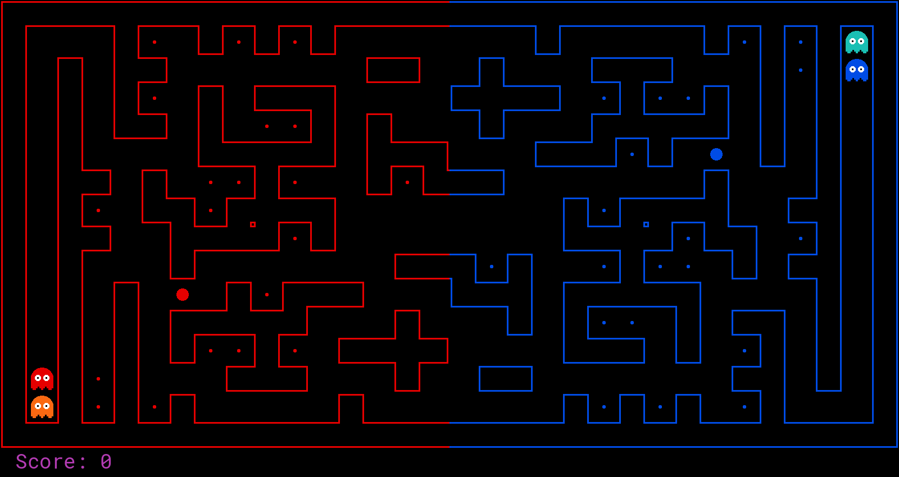

# Pac-Man Multi-Agent AI — Project Archive

Curated files and documentation from a competitive multi-agent Pac-Man AI project
built for a class tournament (CSE 140). This repo is not a fully runnable codebase —
it's an archive of selected source files, development artifacts, and media that
document what we built and how we built it.

---

## Project Overview

The goal was to build a two-agent Pac-Man team to compete in a class tournament
against peer and baseline teams. Our design philosophy centered on a **hybrid
role-switching approach** — both agents capable of dynamically swapping roles based
on game state, so the team would always maintain offensive pressure while keeping
defensive coverage.

The final team paired a trained **Approximate Q-Learning offensive agent** with a
**heuristic-based defensive agent**, and outperformed the majority of baseline and
peer teams despite a tournament meta that heavily favored dual-offense strategies.

---

## The Agents

### Offensive Agent — `CapsuleHunter`
The primary offensive agent (`CapsuleHunter`) extends a base `OffensiveQLearningAgent`
and combines **Approximate Q-Learning** with **ghost-aware A\* pathfinding**.

- **A\*** handles navigation when the path is clear (no ghosts within 5 steps)
- **Q-learning** takes over when enemies are nearby, handling ghost dodging while
  collecting food and capsules
- **Capsule priority**: A\* is modified to target power capsules first when no ghosts
  are present, enabling coordinated offensive windows
- **Temporary defense mode**: if the agent dies and respawns, it switches to
  defensive behavior for 20 turns before returning to offense
- **TeamState coordination**: a shared static class (`TeamState`) tracks capsule
  proximity and scared timers so both agents can coordinate role switches in real time

Q-learning features: `distanceToFood`, `distanceToGhost`, `foodDensity`,
`scaredGhostProximity`, `powerCapsuleDistance`, `ghostScaredTime`, `avoidDeadEnds`, `stop`

Reward structure: food collection (`+1`), death penalty (`-5`), per-step penalty
(`-0.01`) to encourage efficient movement.

**Training** required significant engineering effort. Early attempts caused weight
explosion (e.g. `foodDistance` jumping from `1.0` to `10000.0` within a few
episodes). This was solved through weight sanitization, feature normalization, and a
**three-phase decay schedule** for α and ε — high exploration in phase one, moving
toward convergence in phase two, and fine-tuning in phase three. Training was
randomized across maps to ensure generalization, ultimately achieving a **100% win
rate against the baseline team on any map**. Parallel training instances were
deployed on **Oracle Cloud Infrastructure (OCI)** to reduce training time and enable
extensive experimentation.

---

### Defensive Agent — `FlexibleDefender`
The defensive agent (`FlexibleDefender`) wraps `AggressiveDefensiveAgent` with a
mode-switching layer. By default it plays defense, but switches to offense when:

- The capsule hunter is within 2 steps of a power capsule (coordinated blitz)
- Ghosts are already scared (`TeamState.scared_timer > 5`)
- The defender itself is scared and near the border

**Defensive behavior** (`AggressiveDefensiveAgent`):
- Chases the closest visible invader using distance heuristics
- When no invaders are visible, zones around power pellets first, then
  high-value food closest to enemy offense
- Stays strictly on its side of the map to avoid leaving the defense exposed
- Validates all target positions against the wall grid for compatibility with
  random map layouts

**Offensive behavior** (via `OffenseTwo`):
- Uses a territory-split A\* heuristic — agent 1 prefers the top half of the map,
  agent 2 prefers the bottom half — to avoid both agents clustering on the same food
- Avoids moving toward scared ghosts to prevent accidental kills that would reset
  the scared timer

---

## What's in This Repo

### Standalone Agent Files

| File | Description |
|---|---|
| `offensiveQLearningAgent.py` | Isolated snapshot of the base offensive agent — the core Q-learning + A\* hybrid before any team-level coordination was added. Contains the full feature set, reward structure, weight sanitization, and ghost-aware A\* cost function. |
| `aggressiveDefensiveAgent.py` | Isolated snapshot of the defensive agent — invader pursuit, power pellet zoning, and safe position validation logic, extracted from the team context. |

---

### Team Iterations

| File | Description |
|---|---|
| `myTeam1.py` | **Initial offense + defense split.** `OffensiveQLearningAgent` paired with the first version of `AggressiveDefensiveAgent`. The defensive agent is simpler here — it tracks invaders, guards power pellets, and falls back to chasing enemy food, but lacks the border-aware positioning and `getValidDefensePosition` logic added later. The offensive agent uses a basic single-phase linear decay for α and ε. Lots of debug `print` statements still active. |
| `myTeam2.py` | **Stabilized offense, upgraded defense.** The offensive agent carries over from team 1 with the same weights, but the defensive agent is significantly improved — `getValidDefensePosition` is added, giving the defender smarter border-hugging behavior, map-aware wall validation, and proper fallback logic for random layouts. The `defenseDistance` feature replaces the cruder `foodDistance` fallback. Decay logic is still single-phase. |
| `myTeam3.py` | **Dual-offense experiment.** The defense agent is dropped entirely in favor of running **two independent offensive agents** (`OffenseOne` and `OffenseTwo`). A territory-splitting heuristic is introduced — agent 1 targets food in the top half of the map, agent 2 targets the bottom half — to prevent both agents clustering on the same food. Both agents carry separately trained weights. Two-phase decay is introduced here. This was the dual-offense approach the tournament meta favored. |
| `myTeam4.py` | **Final submitted team.** Returns to an offense + defense split, but now with full hybrid role-switching. Introduces the `TeamState` shared coordination class, `CapsuleHunter` (offense with temporary defense mode on death), and `FlexibleDefender` (defense that blitzes to offense when capsules are active or ghosts are scared). The most complex and best-performing iteration. |

---

### Documentation

| File | Description |
|---|---|
| `MultiAgent-Pacman-AI-Final-Report.pdf` | End-of-term project report covering the design decisions, training challenges, algorithmic choices, and evaluation results for both agents. |

---

### Demo

| File | Description |
|---|---|
| `demo.gif` | Gameplay recordings showing agents in action |

---

## Results

- **100% win rate** against the baseline team across all maps after full training
- Outperformed the majority of peer teams in the class tournament
- Achieved competitive results despite a meta that heavily favored dual-offense
  strategies, which our single-defender setup was most exposed to

---

## Team

Built collaboratively for CSE 140 Artificial Intelligence at UC Santa Cruz.
Adam Xu — offensive agent, training script and pipeline, OCI cloud training setup, hybrid architecture
Elias Campbell — defensive agent, positioning and zoning logic, cross-training loop, hybrid architecture
Jarod Cardenas — repo management, merge coordination, autograder submissions, early defensive agent work
